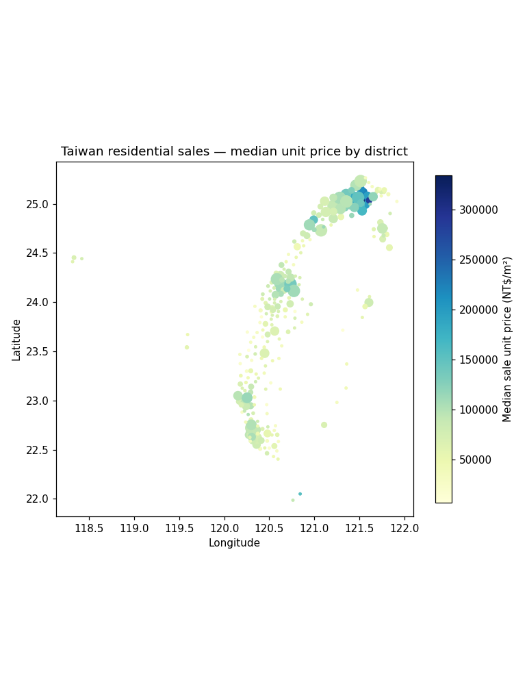

# Taiwan Housing Explorer

A database + interactive map of Taiwan housing transactions, built in Python from the
government **Actual Price Registration** (實價登錄 / LVR) open data. The Mandarin source is
translated to English, normalised into a clean SQLite schema with a geographic hierarchy and an
extensible tagging system, and exported to a **fully static web app** (Leaflet + Chart.js) that
hosts for free, 24/7, with no server.



## What you get

- **`database/taiwanHousing.sqlite`** — the canonical database: `regions → cities → districts → houses`
  plus `houseBuildings / houseLandParcels / houseParking` sub-tables and a `tags / houseTags` system.
  Geometry is stored as WKT (EPSG:4326) so it round-trips into geopandas and opens in QGIS.
- **`webApp/`** — a static dashboard:
  - **Map / Records** toggle (top-left): a Leaflet map (choropleth by median price / volume / size) +
    Chart.js time series, and a sortable **Records** table with a **Download CSV** button.
    Click to drill in with a zoom — region → city → district → a **per-transaction distribution**
    (strip plot by price; the source has no exact coordinates, so no fabricated map points) — and press
    **Esc** to zoom back out one level. Transaction-type, geographic, and tag filters recompute live.
  - **Statistical layer** — every aggregate shows **n, IQR and a bootstrap 95% CI**; controls for
    **minimum sample size**, **transaction-year window**, **excluding deals** (related-party / additions /
    cancelled), **1% winsorizing**, **nominal vs. real (CPI) prices**, and **fixed vs. adaptive colour
    scales**. Toggle **LISA price clusters** (hot/cold spots) on the district map. A **Methods & data
    quality** panel reports the sampling frame, missingness, Moran's I, and a hedonic price model.
  - **Browse database** (`database.html`, linked top-right) — the actual SQLite file loaded in the browser
    with **sql.js** (WebAssembly): every table, all columns, one continuous scroll, plus an ad-hoc SQL box.
  - **About** (`about.html`) — what the project is and how it's built.
  - Full database is also downloadable (`webApp/dataFiles/taiwanHousing.sqlite`).
  CSS/JS are version-tagged (`?v=`) so browsers don't serve stale assets after an update.
- **`spatialAnalysis/exploreDistricts.py`** — a geopandas demo (per-district stats + a plot).

## Data covered

By default, one LVR release (~217 CSVs): **21 cities/counties**, three transaction types —
**sales** (~9,307), **pre-sale** (~1,160), **rentals** (~5,119) = **15,586** transactions.
Each record carries price, area (m² and ping), bed/bath counts, floors, building type, materials,
build age, parking, management/elevator flags, and more. See [`dataDictionary.md`](dataDictionary.md).

### Adding history (2012 → now)
Registration began **2012 Q3**, and the MOI publishes every quarter since. Fetch and ingest them:

```bash
python fetchHistory.py --from 2022          # download quarterly ZIPs into sourceData/ (skips cached)
python buildDatabase.py --seasons-dir sourceData   # load all, newest-first, de-duplicated on 編號
```

`fetchHistory.py` pulls the MOI season ZIPs (`--from`/`--to` accept `2024`, `2024Q3`, or `113S3`;
default = 2012 Q3 → now) and is resumable. Scale notes: **a single quarter is ~130k–200k transactions**,
so the full history is millions of rows and the SQLite DB grows to ~1 GB+. The build stays efficient
(batched inserts; ~40 s/quarter), but at that size the DB is **local-only** (query it in DB Browser /
geopandas) — the web app keeps running on the exported aggregates (computed on the *full* data) plus a
**per-city sample** of records (4,000) so the browser stays fast. The map/stats default to a recent
window; the time chart shows the whole span.

## Quick start

**Just want to view it?** Double-click **`start.bat`** — it serves the app and opens
`http://localhost:8777` in your browser. Close the "Taiwan Housing server" window to stop.
(Only needs Python; the app is already built.)

**To (re)build the data or run everything manually:**

```bash
pip install -r requirements.txt

# 1) ONE-TIME: download Taiwan township boundaries and bundle centroids/polygons.
#    After this, every build is fully offline. (already run; re-run to refresh)
python setupGeoReference.py

# 2) Build the database + web data from the source CSVs.
python buildDatabase.py            # --source-dir to point elsewhere

# 3) Preview the web app locally.
python -m http.server 8777 --directory webApp
#    open http://localhost:8777

# optional: geopandas spatial-stats demo + plot
python spatialAnalysis/exploreDistricts.py

# optional: run the tests
pytest
```

The source CSV folder defaults to `C:\Users\Caden\Downloads\lvr_landcsv`
(override with `python buildDatabase.py --source-dir <path>`).

## Project layout

```
buildDatabase.py        one command: schema → load → tag → spatial → export
setupGeoReference.py    one-time geo bootstrap (network)
dataPipeline/           ETL: parsers, mappings, schema, loader, tagging, spatial, exporter
geoReference/           bundled township boundaries + district centroids (committed)
database/               built SQLite database
webApp/                 static site (deploy this folder)  — see deploymentGuide.md
spatialAnalysis/        geopandas demo + output plot
tests/                  pytest unit + smoke tests
```

## Design notes

- **No coordinates / no schools in the source.** Mapping is at **district** resolution using bundled
  centroids derived from official township boundaries (offline). Per-house geocoding and true
  school-distance are intentionally deferred behind nullable columns
  (`latitude`, `longitude`, `nearestSchool*`) — a future `enrichSchools.py` can fill them.
- **Time coverage.** Most volume sits in the current release window, but transaction dates extend back
  to ~2016, so the "market over time" charts have real history. Add more LVR releases to deepen it.
- **Housing views** exclude land-only and parking-only transactions so price metrics describe dwellings.
- **Naming:** files, directories, DB tables/columns and JSON keys use lowerCamelCase (only
  `requirements.txt`, `README.md`, `index.html` keep their tooling-fixed names).

## Deployment

The `webApp/` folder is 100% static — host it free and 24/7 on GitHub Pages, Cloudflare Pages, or
Netlify. See [`deploymentGuide.md`](deploymentGuide.md).

## Attribution

Source: Ministry of the Interior, Taiwan — Real Estate Actual Price Registration (不動產成交案件實際資訊).
Township boundaries: ronnywang/twgeojson (public). Map tiles: © OpenStreetMap contributors.
