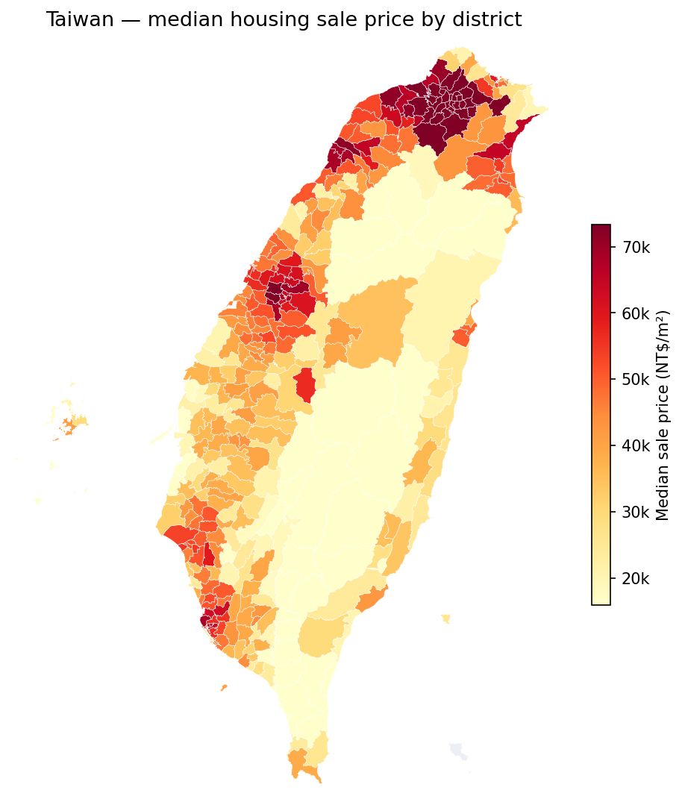

# Taiwan Housing Explorer

An interactive website for exploring Taiwan's housing market, built from the government's public
**Actual Price Registration (實價登錄 / LVR)** records. It runs entirely in your browser — no login,
no paywall, no backend.

**Try it here → https://kadentato.github.io/taiwanHousing/**

## What it is

Every property sale in Taiwan gets reported to the government and published as open data, but the raw
files are messy, written in Mandarin, and honestly not much fun to dig through. This site takes the
full history of those records, cleans them up, translates them into English, and turns them into
something you can actually explore — about **3.5 million housing sales from 2012 to 2026**.

## What's on the site

**🗺️ The map** — Prices by area, from a national view all the way down to individual homes. Click
through region → city → district, and for **Taipei, New Taipei, Taichung, Taoyuan and Tainan** the
individual sales appear at their **real street addresses** (geocoded from the government's address data). Hover over any
dot to see that home's price, size, layout, age, and features. There's also a time-series chart going
back to 2012, a sortable records table you can download as a CSV, and filters for transaction type,
year range, and property tags.

**🔮 The price predictor** — Describe a home (where it is, how big, how old, its features) and get an
estimated price, plus 50% / 80% / 95% confidence ranges so you can see how sure the model actually is.
It's a gradient-boosted model that runs completely in your browser, so nothing you type gets sent
anywhere.

**🔎 Browse the data** — The actual dataset, loaded right in your browser, with every table and column
and an SQL box if you want to run your own queries.

## What you can use it for

- **House hunting, or just being curious** — see what homes in a given neighbourhood actually sold for,
  compare which districts are pricey versus affordable, and get a rough idea of what a specific place
  might be worth.
- **Learning statistics** — it's a big, real dataset with a genuine time-series component, which makes
  it great for practising things like trend analysis, medians versus means, confidence intervals, and
  spatial patterns. There's even a tidy CSV of the monthly price series if you'd rather load it straight
  into pandas or R.
- **Getting a feel for the market** — long-run price trends by area and property type, how far the
  market has moved, and where the activity actually is.

## About the data (and some honesty)

The site uses the **full LVR history, 2012 Q3 → 2026 Q2, housing sales only (~3.5M de-duplicated
deals)**. A few things worth knowing before you read too much into it:

- **Prices are nominal NT$**, taken straight from the registry. The most recent months always
  undercount a bit, because sales are disclosed in batches with a lag.
- **Exact house locations only exist for the five biggest metros — Taipei, New Taipei, Taichung,
  Taoyuan and Tainan** (roughly 70–90% of their sales). Everywhere else, the dots are scattered within
  the district, since the source doesn't provide coordinates there yet.
- **The predictor is an estimate, not an appraisal.** A lot of what makes one home cost more than
  another — renovations, the exact floor, the view, how the negotiation went — simply isn't in the
  public data, so treat the ranges as a ballpark rather than a promise. Please don't use it as financial
  advice.

Want the details? [`dataDictionary.md`](dataDictionary.md) explains every field, and
[`modelCard.md`](modelCard.md) covers how the predictor works, how accurate it is, and where it
shouldn't be trusted.

## How it's built

It's a fully static site — just HTML, CSS, and JavaScript reading pre-computed data files — so it hosts
for free on GitHub Pages and stays up 24/7 with no server to run, and every push auto-deploys. If you'd
like to run or rebuild it yourself, [`deploymentGuide.md`](deploymentGuide.md) has the steps.

## Credits

Data: Ministry of the Interior, Taiwan — Real Estate Actual Price Registration (不動產成交案件實際資訊).
Map boundaries: ronnywang/twgeojson. Map tiles: © OpenStreetMap contributors.
